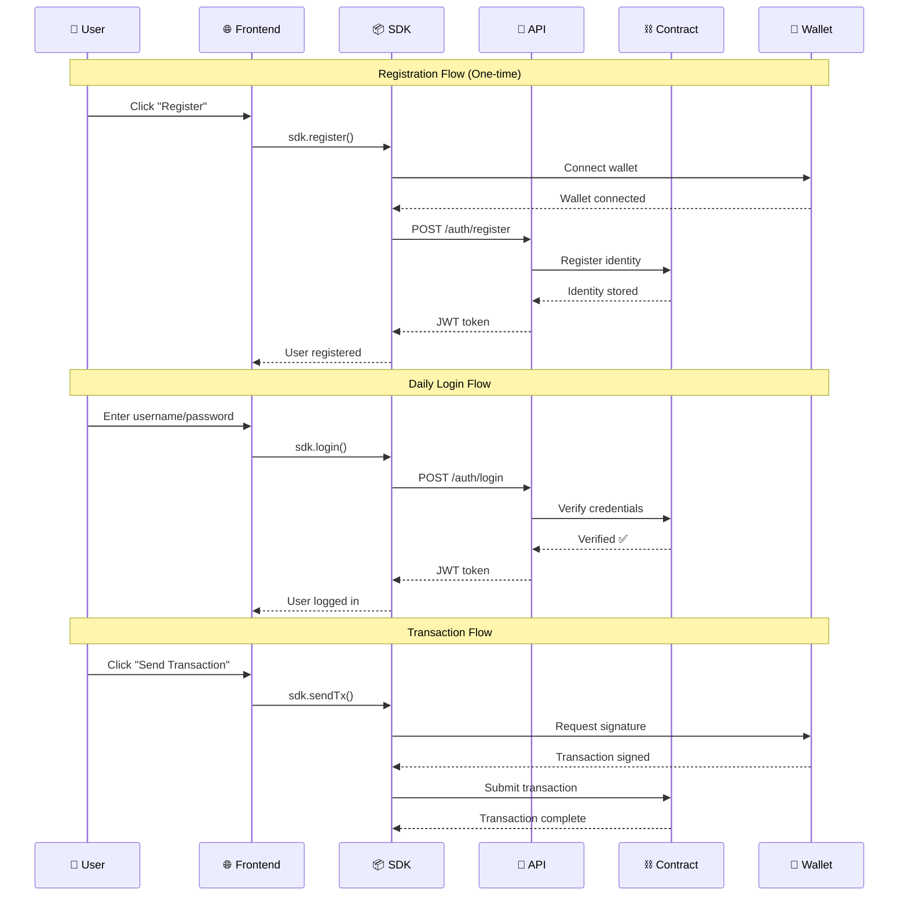
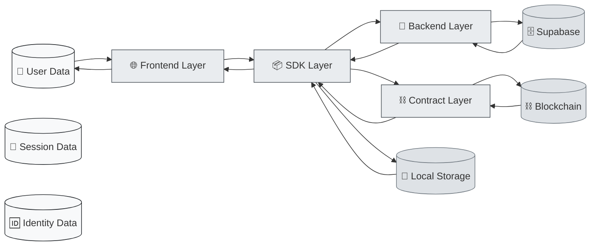
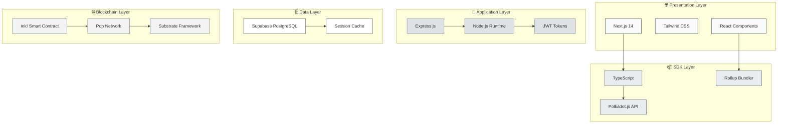

# Authentify System Architecture

## 🚀 Overview

Authentify is a hybrid Web3 authentication platform built on Polkadot that bridges traditional Web2 UX with Web3 security:

- **One-Time Wallet Connection**: Connect wallet once during registration, then use Web2-style login
- **Hybrid Authentication**: Username/password for daily access, wallet only for transactions
- **Cross-Chain Identity**: Single identity across multiple blockchain networks
- **Developer-First SDK**: Production-ready TypeScript SDK with React components
- **Biometric Ready**: Future-proof with WebAuthn and biometric authentication support
- **Enterprise Security**: JWT sessions, OAuth integration, rate limiting, audit trails

## 📁 System Architecture

Our **three-layer hybrid approach** consists of distinct but integrated components:

```
authentify/
├── contract/          # ink! Smart Contract (Polkadot)
├── backend/          # Node.js API Server (Express + Supabase)  
├── frontend/         # Next.js Documentation Platform
├── sdk/              # Published NPM Package (TypeScript)
└── ARCHITECTURE.md   # This file
```

## 🌐 Deployed System (Pop Network Paseo Testnet)

| Component               | Address/URL                                        | Status              |
| ----------------------- | -------------------------------------------------- | ------------------- |
| **Smart Contract**      | `5GrwvaEF5zXb26Fz9rcQpDWS57CtERHpNehXCPcNoHGKutQY` | ✅ Deployed         |
| **Backend API**         | `https://api.authentify.dev`                      | ✅ Production Ready |
| **Documentation Site**  | `https://docs.authentify.dev`                     | ✅ Live             |
| **NPM SDK Package**     | `authentify-sdk@1.0.5`                            | ✅ Published        |
| **Demo Application**    | `https://demo.authentify.dev`                     | 🚧 In Development   |

> **Network**: Pop Network (Paseo Testnet)  
> **RPC**: `wss://rpc1.paseo.popnetwork.xyz`  
> **Last Updated**: November 2024

## 🏗️ High-Level Architecture Flow

```mermaid
graph TD
    %% User Layer
    U[👤 Developer/End User] --> F[🌐 Frontend App]
    U --> D[📱 dApp Integration]
    
    %% Frontend Layer
    F --> SDK[📦 Authentify SDK]
    D --> SDK
    
    %% SDK Components
    SDK --> AC[🔗 API Client]
    SDK --> CC[⛓️ Contract Client]
    SDK --> RC[⚛️ React Components]
    
    %% Backend Services
    AC --> API[🚀 Backend API]
    API --> DB[(🗄️ Supabase DB)]
    API --> JWT[🔐 JWT Service]
    API --> OAUTH[🔑 OAuth Providers]
    
    %% Blockchain Layer
    CC --> W[👛 Wallet Extension]
    CC --> BC[⛓️ Smart Contract]
    W --> BC
    
    %% External Services
    OAUTH --> G[📧 Google]
    OAUTH --> GH[🐙 GitHub]
    BC --> PN[🔗 Pop Network]
    
    %% Black and White Styling
    classDef userLayer fill:#f8f9fa,stroke:#212529,stroke-width:2px
    classDef frontendLayer fill:#e9ecef,stroke:#495057,stroke-width:2px
    classDef sdkLayer fill:#dee2e6,stroke:#6c757d,stroke-width:2px
    classDef backendLayer fill:#ffffff,stroke:#343a40,stroke-width:2px
    classDef blockchainLayer fill:#f1f3f4,stroke:#5f6368,stroke-width:2px
    classDef externalLayer fill:#fafafa,stroke:#9aa0a6,stroke-width:2px    class U,F,D userLayer
    class SDK frontendLayer
    class AC,CC,RC sdkLayer
    class API,DB,JWT,OAUTH backendLayer
    class W,BC,PN blockchainLayer
    class G,GH externalLayer
```

## 📋 Component Breakdown

### 🎯 **Layer 1: User Interaction**

| Component            | Purpose              | Technology           |
| -------------------- | -------------------- | -------------------- |
| **Frontend App**     | Documentation & Demo | Next.js 14, Tailwind |
| **dApp Integration** | Third-party apps     | Any framework + SDK  |

### 📦 **Layer 2: SDK (Published Package)**

| Component            | Purpose                  | Technology        |
| -------------------- | ------------------------ | ----------------- |
| **API Client**       | HTTP requests to backend | Axios, TypeScript |
| **Contract Client**  | Blockchain interactions  | @polkadot/api     |
| **React Components** | Pre-built UI components  | React, Tailwind   |

### 🚀 **Layer 3: Backend Services**

| Component           | Purpose                  | Technology          |
| ------------------- | ------------------------ | ------------------- |
| **Backend API**     | Business logic & routing | Express.js, Node.js |
| **Supabase DB**     | User data & sessions     | PostgreSQL          |
| **JWT Service**     | Session management       | jsonwebtoken        |
| **OAuth Providers** | Social authentication    | Passport.js         |

### ⛓️ **Layer 4: Blockchain**

| Component            | Purpose                   | Technology            |
| -------------------- | ------------------------- | --------------------- |
| **Wallet Extension** | User's wallet             | Polkadot.js, MetaMask |
| **Smart Contract**   | Identity verification     | ink!, Rust            |
| **Pop Network**      | Blockchain infrastructure | Polkadot ecosystem    |

---

## 🔄 Authentication Flow Diagram



---

## 🗂️ Data Flow Architecture



---

## 🔧 Technology Stack Visualization



---

## 🏁 Quick Start Integration Flow

```mermaid
graph TD
    START([🚀 Start Integration]) --> INSTALL[📦 npm install authentify-sdk]
    INSTALL --> CONFIG[⚙️ Configure SDK]
    CONFIG --> INIT[🔧 Initialize SDK]
    INIT --> CHOICE{Integration Type?}
    
    CHOICE -->|Simple Auth| BASIC[🔐 Basic Login/Register]
    CHOICE -->|React App| COMPONENTS[⚛️ Use React Components]
    CHOICE -->|Blockchain| CONTRACT[⛓️ Contract Integration]
    
    BASIC --> DEPLOY[🚀 Deploy & Go Live]
    COMPONENTS --> DEPLOY
    CONTRACT --> DEPLOY
    
    DEPLOY --> SUCCESS([✅ Production Ready])
    
    %% Black and White Styling
    classDef startEnd fill:#f8f9fa,stroke:#212529,stroke-width:3px
    classDef process fill:#e9ecef,stroke:#495057,stroke-width:2px
    classDef choice fill:#ffffff,stroke:#6c757d,stroke-width:2px
    
    class START,SUCCESS startEnd
    class INSTALL,CONFIG,INIT,BASIC,COMPONENTS,CONTRACT,DEPLOY process
    class CHOICE choice
```## 📊 Performance & Scalability Metrics

| Component          | Current Scale | Bottleneck      | Solution           |
| ------------------ | ------------- | --------------- | ------------------ |
| **Smart Contract** | 1K+ users     | Gas costs       | Batch operations   |
| **Backend API**    | 10K+ req/min  | Database        | Connection pooling |
| **SDK Bundle**     | 94KB gzipped  | Bundle size     | Tree shaking       |
| **Frontend**       | Global CDN    | SSR performance | Edge caching       |

---

## 🔒 Security Architecture

```mermaid
graph TD
    subgraph "🛡️ Security Layers"
        INPUT[🔍 Input Validation]
        RATE[⏱️ Rate Limiting]
        AUTH[🔐 JWT Authentication]
        CRYPTO[🔒 Encryption]
    end
    
    subgraph "🔐 Authentication Flow"
        PWD[🔑 Password Hashing]
        WALLET[👛 Wallet Signature]
        SESSION[📋 Session Management]
    end
    
    subgraph "⛓️ Blockchain Security"
        CONTRACT[📝 Smart Contract]
        CONSENSUS[✅ Network Consensus]
        IMMUTABLE[🔒 Immutable Storage]
    end
    
    INPUT --> RATE
    RATE --> AUTH
    AUTH --> CRYPTO
    PWD --> WALLET
    WALLET --> SESSION
    CONTRACT --> CONSENSUS
    CONSENSUS --> IMMUTABLE
    
    %% Black and White Styling
    classDef security fill:#f8f9fa,stroke:#212529
    classDef auth fill:#e9ecef,stroke:#495057
    classDef blockchain fill:#dee2e6,stroke:#6c757d
    
    class INPUT,RATE,AUTH,CRYPTO security
    class PWD,WALLET,SESSION auth
    class CONTRACT,CONSENSUS,IMMUTABLE blockchain
```This architecture represents a **production-ready, scalable Web3 authentication platform** that bridges traditional Web2 UX with Web3 security through thoughtful design and comprehensive implementation.
